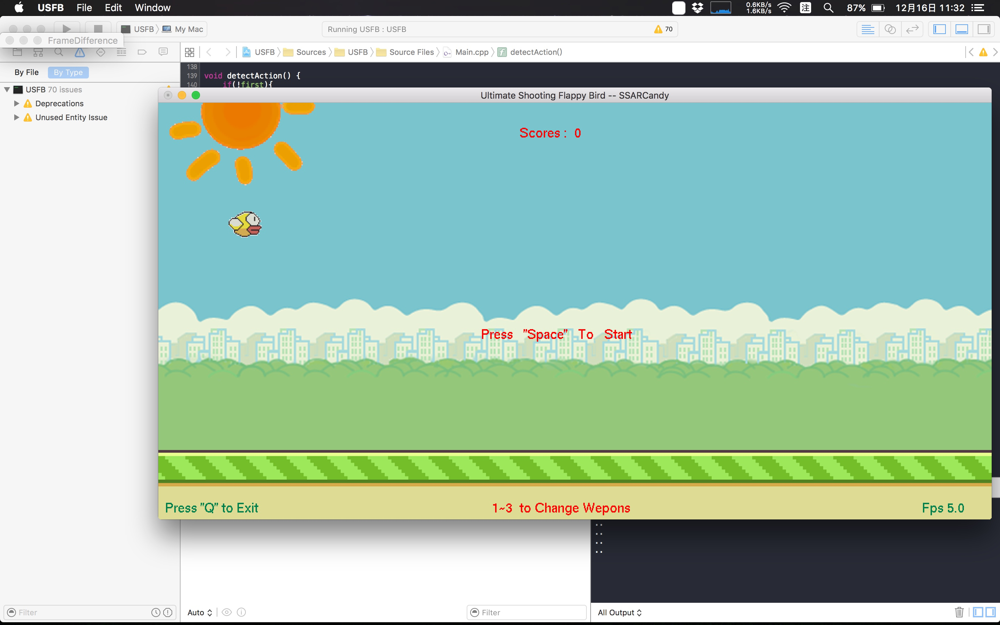

# USFB with CV
### A simple 2D game integrated with openCV webcam input

--

#### Ref
Oringin game fork from my another [repo](https://github.com/SSARCandy/Ultimate-Shooting-Flappy-Bird).  
In this repo, I modify the game goal to have better fit with CV input.

#### Build
 - Required:
   - openCV
   - openGL
   - glut
 - for Mac:
   1. use CMake (min ver3.0) -> choose `xcode`
   2. move `images/` to build directory  
   3. add `openGL.framework`, `glut.framework` and core lib of `opencv` (usually will at `/usr/local/lib`)
 - for Windows:
   1. use Cmake -> choose `VisualStudio `
   2. move `images/` to build directory
   3. set `USFB` as startup project

#### Game Intro：
You will controll a yellow flappy-bird  
The goal of this game is to keep dodging the enemies birds, try to live as long as possible.   
The gameScore will +1 when you dodge an enemy bird.  

#### Control：
 - With Keyboard:
    - START: `SPACE`
    - UP: `W/w`
    - DOWN: `S/s`
 - With webcam(CV):
    - UP: `Move your hand to top area`
    - DOWN: `Move your hand to bottom area`

#### ScreenShot

Tag: openGL, glut, 2D game, flappy bird, openCV, background-subtraction
