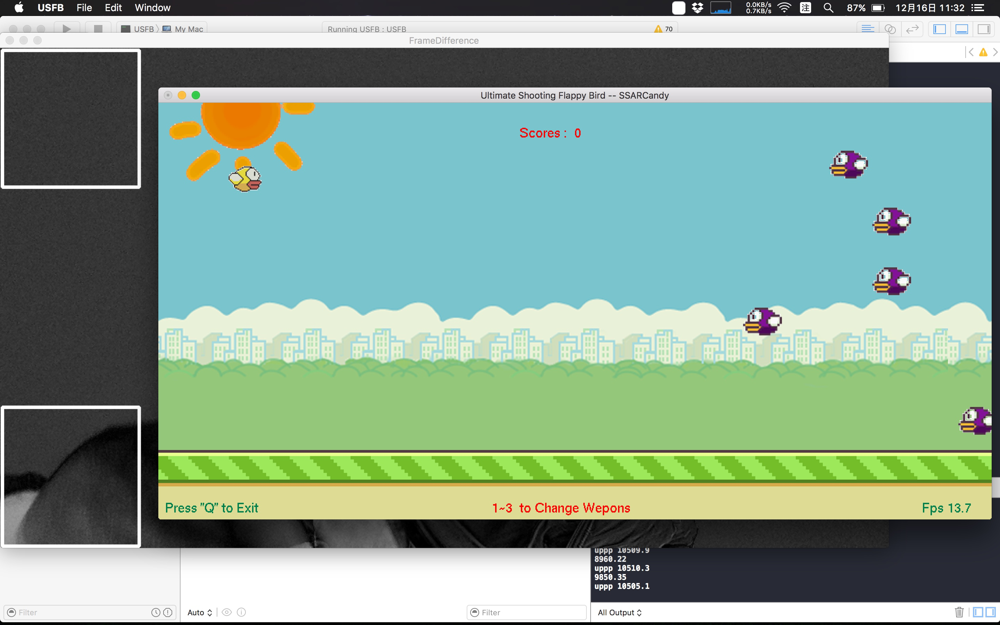

# Ultimate Shooting Flappy Bird
### A simple 2D game implement with glut tool(openGL)

--

#### Build
1. use CMake (min ver3.0)
2. move `images/` to build directory  

#### 遊戲目的：　取得高分以獲得成就感。

#### 遊戲簡介：

- 藉由操控主角(黃色Flappy Bird)跳躍及射擊，
- 擊落敵方(紫色Flappy Birds)以取得分數。
- 觸摸到敵方或地面會導致主角死亡並結束遊戲。(在太陽中待太久會被烤焦)。
- 隨著遊戲的進行難度將會越來越高。（速度會變快）

#### 操作方式：
- 按鍵Ｑ : 離開遊戲
- 空白鍵(Space) : 跳躍及射擊
- 數字鍵(1～3)  : 切換武器
   - 1:普通子彈
   - 2:穿透型雷射
   - 3:方塊墜落彈

#### 遊戲畫面

Tag: openGL, glut, 2D game, flappy bird, shooting game, NCCUCS-3D-game-programming
